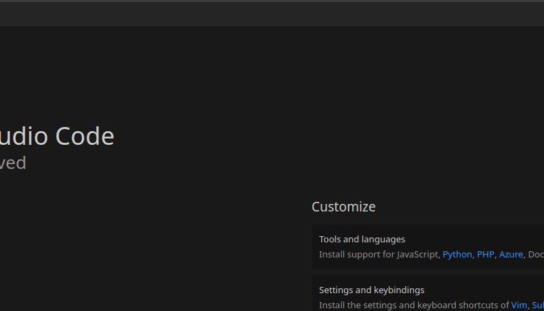

# adb-wlan README

This extension help you to connect your real phone over WIFI with ADB protocol to your PC without cable

## Features

Open terminal and write "Connect device" and the ip of the mobile.

Disconnect when you don´t need use

## Requirements

You have to had installed ADB to connect your device

[How to install](https://www.xda-developers.com/install-adb-windows-macos-linux/)

## Release Notes

### 1.0.0

Initial release of extensions, you can connect manually your device

